# Auditoría UX — estado anterior a las correcciones

**Fecha:** 9 de septiembre de 2026, 07:02–07:10 UTC.  
**Superficie:** [SWARM SIGNAL público](https://edson-zepeda.github.io/swarm-signal-openlab/) y servidor local disponible en el puerto 8766.  
**Tarea del evaluador:** entender qué se entrega, revisar las ocho etapas, distinguir ejecución y propuesta, abrir el video y encontrar cómo reproducir o medir localmente.  
**Alcance:** experiencia, navegación y accesibilidad observable. La validez científica, el cumplimiento íntegro del PDF y el empaquetado se evalúan por separado.

## Dictamen

La interfaz permite ver datos y reconoce sus límites, pero todavía exige que el evaluador descubra por su cuenta el recorrido de entrega. El problema principal es funcional: una visita nueva oculta automáticamente la cabecera y la navegación. La web pública tampoco conduce a la ejecución local, y parte de la evidencia termina en archivos JSON extensos. La presentación visual no compensa estas barreras.

No procede llamarlo «impecable» ni asignarle una calificación perfecta. Las correcciones propuestas conservan el proyecto y sirven a la revisión del reto; no requieren añadir funcionalidades ajenas al PDF.

## Método y límites

Se abrió una sesión de Edge aislada, sin perfil personal ni autenticación, mediante Playwright CLI. El navegador integrado no estuvo disponible. Se revisaron capturas nuevas a 1440 × 900 y 390 × 844, el árbol accesible, valores del DOM, reproducción y controles del formulario. Se abrieron y revisaron los doce PNG de este informe antes de aceptarlos.

No se reutilizaron las capturas del QA anterior. No se modificó el producto, no se inició ninguna captura de hardware y no se declararon condiciones físicas observadas. La selección «Caminando» se probó únicamente dentro del formulario y se canceló. No se realizó una sesión con lector de pantalla ni una auditoría WCAG completa. Una ejecución fresca de Axe limitada al diálogo devolvió cero incidencias; eso no verifica la claridad de sus nombres o del flujo completo.

## Lo que conviene conservar

- El estado «Captura grabada» y «Movimiento físico sin etiquetar» separan la demostración de una medición física confirmada.
- La captura pública termina en «Sin veredicto / Muestreo irregular», sin sustituirlo por una detección humana inventada.
- Evidencia muestra **6 / 8** y distingue dos etapas parciales. El estado no depende únicamente del color.
- La propuesta diferencia la laptop actual del despliegue futuro con dron y Raspberry Pi; el video dispone de capítulos y descarga.
- El formulario local tiene etiquetas visibles, condición «Sin etiqueta» inicial y un protocolo breve cuando se elige «Caminando». Escape cierra el diálogo y devuelve el foco a «Iniciar captura».

## Hallazgos priorizados

P1 = obstáculo relevante para revisar o reproducir la entrega. P2 = fricción o riesgo de comprensión que debe corregirse. No se observó un fallo P0 en este recorrido.

| ID | Prioridad | Hallazgo | Evidencia fresca |
|---|---|---|---|
| UX-01 | P1 | La entrada salta debajo de la navegación | Pasos 1 y 8; DOM: `scrollY = 342` a 1440 × 900 |
| UX-02 | P1 | Los entregables están dispersos y la entrada no explica qué revisar | Pasos 2, 3, 5 y 6 |
| UX-03 | P1 | La web pública no conduce a medir localmente | Pasos 2, 8, 10 y 11 |
| UX-04 | P2 | «Ver evidencia» exige interpretar un JSON extenso | Pasos 3 y 4 |
| UX-05 | P2 | El control principal de replay no refleja que está reproduciendo | Paso 9; etiquetas simultáneas distintas |
| UX-06 | P2 | El estado de calidad informa, pero no ayuda a continuar | Pasos 1 y 12 |
| UX-07 | P2 | Las gráficas mezclan alcances temporales sin ubicarlos visualmente | Pasos 1, 9 y 12 |
| UX-08 | P2 | El significado de algunos controles se pierde sin visión | Pasos 3, 9 y 10; atributos y árbol accesible |

### UX-01 — Entrada y orientación ocultas

**Observación.** Al abrir la URL pública sin fragmento, la página termina en `#monitor` y queda desplazada 342 px. Se reprodujo dos veces. La cabecera queda arriba del viewport, el título comienza en y = −210.5 y la navegación en y = −88.9. En móvil, al volver desde el video, tampoco se ven la navegación ni el indicador «Captura grabada».

**Impacto.** Un evaluador puede concluir que solo recibió un monitor, sin descubrir la evidencia, la propuesta o el video. Las capturas de página completa anteriores ocultaban este defecto del primer viewport.

**Cambio propuesto.** Evitar crear un ancla navegable durante la carga inicial; separar el estado de pestaña del desplazamiento. Mantener una navegación accesible al recorrer páginas largas y resolver los enlaces directos sin ocultarla.

**Aceptación.** Una visita nueva a `/` empieza en y = 0; `#evidencia` abre la sección correcta con navegación visible. Volver desde el video conserva una orientación clara en escritorio y móvil.

### UX-02 — Entrega dispersa

**Observación.** La entrada dice «Observatorio Wi-Fi / Lee lo invisible», pero no identifica el alcance concreto de la entrega de software. Informe, PDF de propuesta y demo aparecen únicamente en Evidencia. La pestaña Propuesta carece de enlace a su propio PDF. El repositorio se encuentra al pie de la página de video, fuera del recorrido principal del monitor.

**Impacto.** Revisar los tres componentes exige explorar pestañas y páginas por ensayo. La misma palabra «Propuesta» designa una pestaña y un PDF sin distinguirlos.

**Cambio propuesto.** Añadir una identificación breve del entregable y un acceso compacto a «8 etapas», «Propuesta PDF», «Video» y «Código». Reutilizarlo en las vistas pertinentes, sin crear una nueva landing ni texto promocional.

**Aceptación.** Desde la primera pantalla, cada entregable obligatorio se identifica y abre con una acción; desde Propuesta se descarga su documento sin volver a Evidencia.

### UX-03 — La reproducción pública es un callejón sin salida para la ejecución local

**Observación.** La web pública ofrece una captura deshabilitada en el selector y «Reproducir captura». No presenta una acción que explique cómo obtener el código y ejecutar el receptor local. El formulario «Iniciar captura» solo se encontró porque el auditor ya conocía la dirección del servidor local.

**Impacto.** Quien quiera reproducir el experimento puede confundir las limitaciones del sitio estático con las del proyecto o no saber que la captura funcional existe.

**Cambio propuesto.** Mostrar una acción secundaria «Medir en mi equipo» con los pasos mínimos y un enlace al README o arranque documentado. Mantener claro que GitHub Pages reproduce datos y que la captura usa el adaptador local.

**Aceptación.** Un evaluador llega desde el sitio público a las instrucciones verificables de ejecución, reconoce el requisito de Wi-Fi y sabe qué acción inicia una captura. No se promete medir desde una página estática.

### UX-04 — Evidencia técnicamente accesible, difícil de evaluar

**Observación.** «Ver evidencia» en la etapa 5 abre otra pestaña con JSON y cientos de muestras. El primer viewport muestra campos y timestamps, pero no una captura del monitor ni una guía de qué comprobar. Las ocho tarjetas repiten el mismo nombre de enlace.

**Impacto.** El evaluador tiene acceso al archivo, pero debe reconstruir su significado. Que el archivo abra no equivale a que la prueba se pueda revisar rápidamente.

**Cambio propuesto.** Priorizar en cada etapa una evidencia visible pertinente —por ejemplo, la captura real del monitor para la etapa 5— y conservar el JSON como «Datos originales». Usar enlaces específicos: «Ver captura de la etapa 5», «Abrir resultado de pruebas».

**Aceptación.** Cada tarjeta enlaza a una prueba reconocible, explica brevemente qué acredita y conserva el original. La evidencia parcial sigue marcada como parcial; una captura no se presenta como validación del movimiento humano.

### UX-05 — Reproducción con dos estados de control incompatibles

**Observación.** Tras pulsar el botón grande, este sigue diciendo «Reproducir captura», mientras el botón pequeño del gráfico ya dice «Pausar reproducción». En móvil, el primero está al inicio y el segundo cerca de y = 752 del viewport observado. Volver a tocar la acción principal no sirve para pausar.

**Impacto.** La acción más visible no refleja el estado de la tarea y obliga a buscar otro control para detenerla. Es fricción innecesaria al comparar un instante o leer un resultado.

**Cambio propuesto.** Sincronizar ambos controles como reproducir/pausar; ofrecer reinicio como acción distinguible si se conserva. Mantener el estado temporal y las cifras ligados a las muestras reales.

**Aceptación.** Cualquiera de los dos controles pausa o continúa la misma reproducción, actualiza texto y nombre accesible, y mantiene el instante seleccionado.

### UX-06 — Calidad sin salida práctica

**Observación.** «Muestreo irregular» y la explicación visible indican que no puede emitirse un indicio confiable. Al expandir «Ver criterio» aparecen 33.6 % de irregularidad y una ventana de 15 s, pero no una acción para repetir en mejores condiciones o revisar otra captura.

**Impacto.** El resultado es honesto, pero puede parecer el fin del proyecto. No distingue claramente entre «el analizador funciona y rechaza esta ventana» y «el sistema no sirve».

**Cambio propuesto.** Añadir una siguiente acción según el modo: revisar calidad de otras capturas reales disponibles o preparar una nueva captura local. Explicar en una frase la condición que invalida el resultado, sin ocultar la captura defectuosa ni favorecer selectivamente una conclusión.

**Aceptación.** Una ventana inválida conserva «Sin veredicto» y ofrece una recuperación aplicable. Si se comparan capturas, se muestran calidad, muestreo y condición física sin confirmar; no se transforma la comparación en una validación humana.

### UX-07 — Falta ubicar el intervalo analizado

**Observación.** RSSI muestra casi 120 s; la tarjeta de varianza corresponde a la captura, la segunda gráfica dice «Ventana móvil / 5 s» y el criterio indica 15 s dentro de un desplegable. El espectro no señala en su propio panel qué intervalo temporal está representando.

**Impacto.** Un evaluador puede atribuir el espectro o el veredicto al mismo intervalo que el gráfico completo y no saber qué zona está comparando al mover el replay. Este es un problema de comunicación del análisis, independientemente de que las fórmulas sean correctas.

**Cambio propuesto.** Identificar la ventana analizada y su intervalo en el gráfico principal y en el encabezado del espectro. Distinguir las métricas globales de las de ventana mediante etiquetas breves, sin añadir paneles redundantes.

**Aceptación.** Al pausar en cualquier instante se entiende qué muestras alimentan cada vista; el intervalo señalado y los valores corresponden al mismo frame real.

### UX-08 — Semántica insuficiente para controles esenciales

**Observación.** El slider usa min = 0, max = 1000 y carece de `aria-valuetext`: una posición se expone como «39» en lugar de segundos. El diálogo no tiene `aria-label` ni `aria-labelledby`; en el árbol aparece «dialog» sin nombre, aunque visualmente tiene título. El foco inicial cae en «Cerrar». Los enlaces de evidencia comparten un nombre indistinguible al listarlos.

**Impacto.** Un usuario que depende del teclado y de una lista de controles pierde contexto temporal o propósito. No se afirma que estos hallazgos, por sí solos, certifiquen una infracción WCAG; son riesgos concretos que el pase automático del diálogo no descartó.

**Cambio propuesto.** Dar al slider un valor accesible de tiempo y duración; asociar el diálogo a su título y establecer un foco inicial útil; nombrar cada evidencia por su etapa o contenido.

**Aceptación.** El slider anuncia «X de Y segundos», el diálogo anuncia su propósito y la navegación por enlaces permite identificar la prueba antes de abrirla. Comprobar después con teclado y lector de pantalla.

## Recorrido y capturas aceptadas

1. **Entrada pública — deficiente.** La página entra desplazada y oculta navegación e identidad.  
   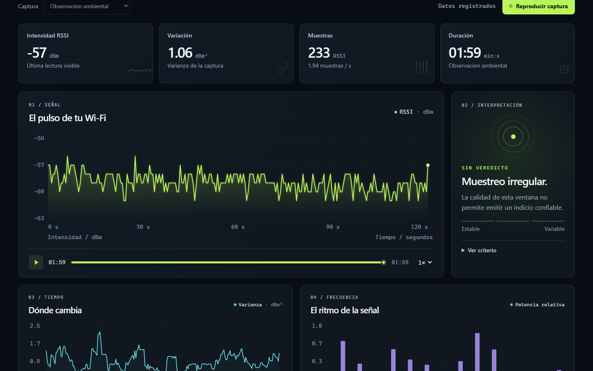
2. **Cabecera recuperada con Home — funcional, contexto incompleto.** Vuelve a verse la navegación; los entregables todavía no están a la vista.  
   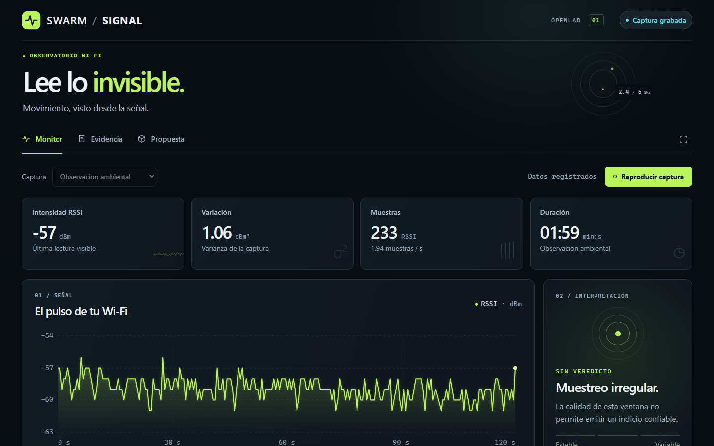
3. **Ocho etapas — funcional con fricción.** Estados y documentos visibles; el evaluador aún debe interpretar las pruebas enlazadas.  
   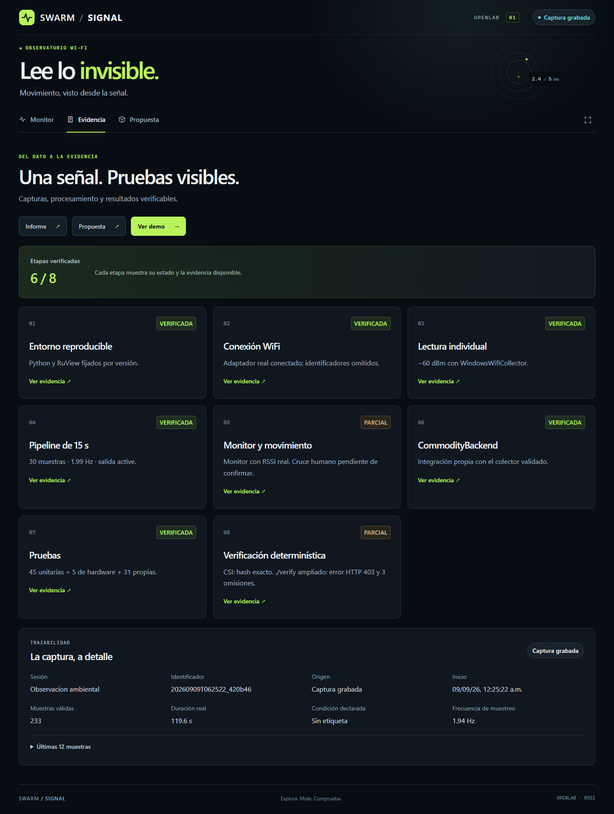
4. **Abrir etapa 5 — poco orientado a revisión.** El enlace lleva a datos en bruto.  
   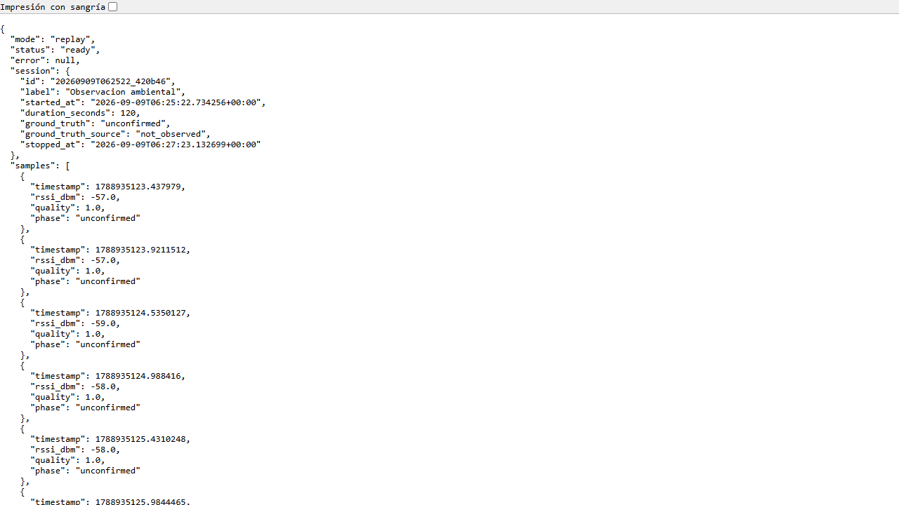
5. **Propuesta — clara en sus límites.** Diferencia prototipo actual y despliegue futuro; falta acceso directo al PDF.  
   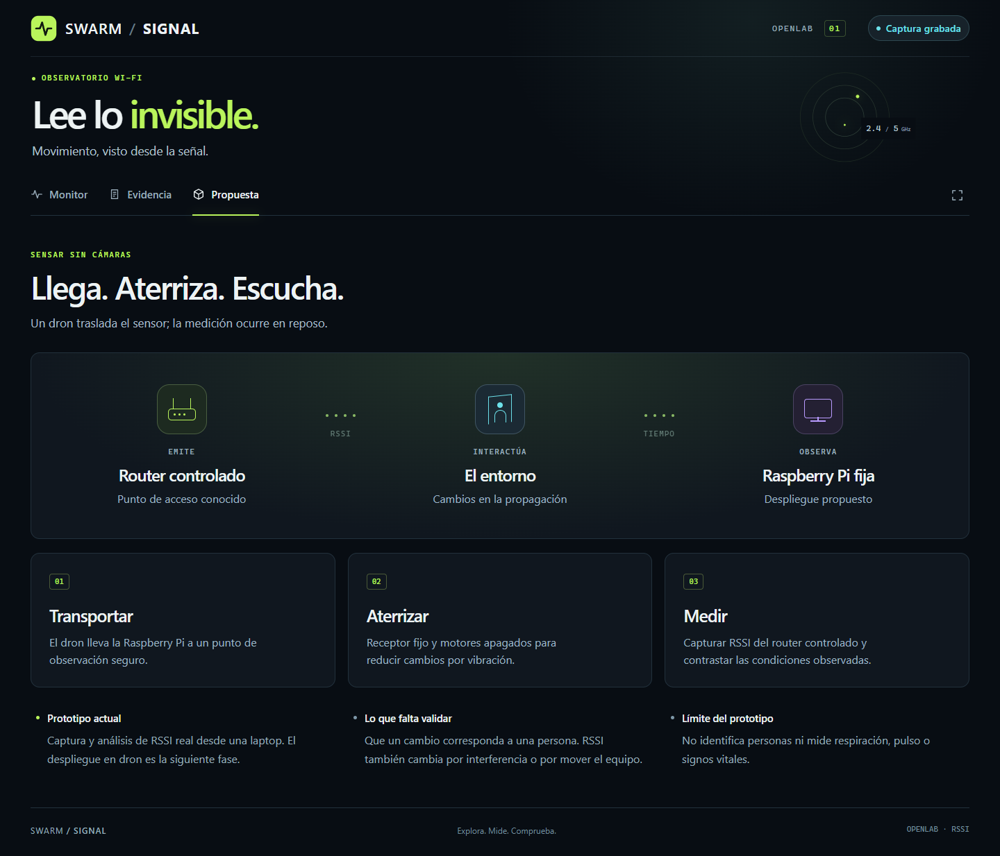
6. **Demo en escritorio — funcional.** Reproductor, capítulos, documentos y código están presentes.  
   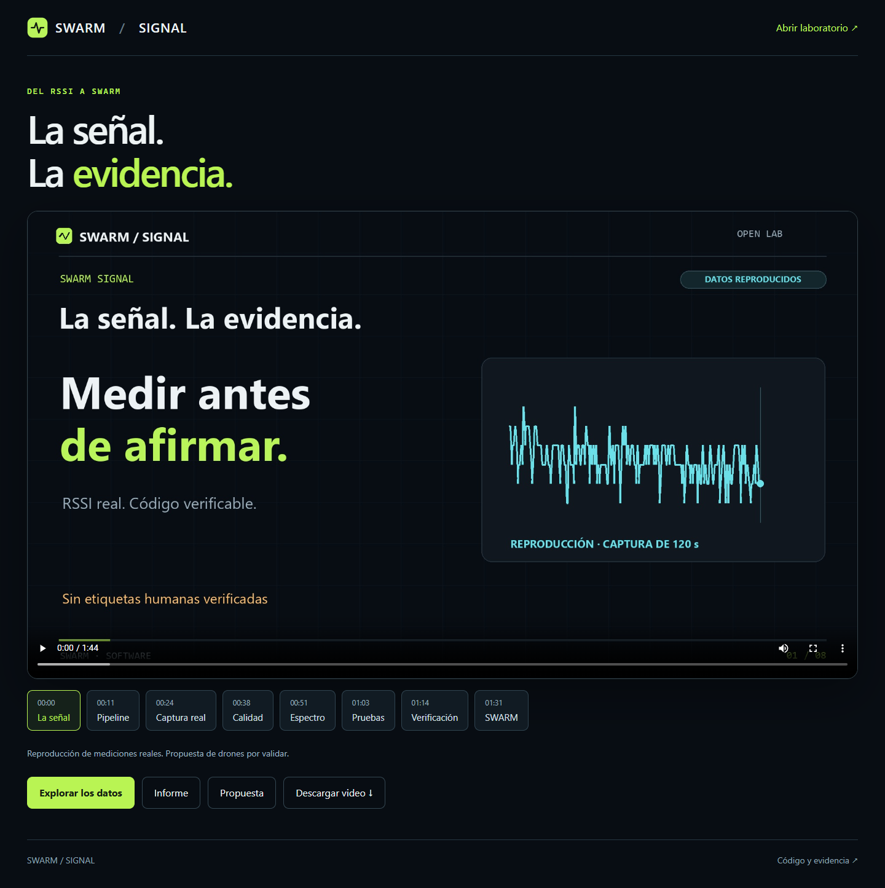
7. **Demo móvil — utilizable.** El contenido cabe; capítulos usan desplazamiento horizontal. No se evalúa la legibilidad interna de todo el video a partir de una portada.  
   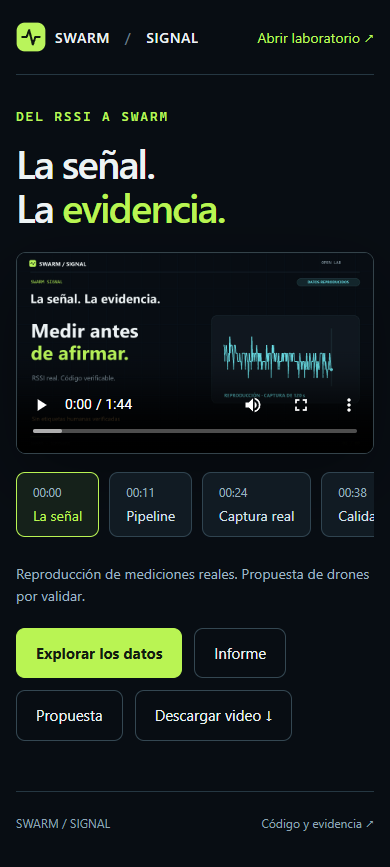
8. **Volver al monitor móvil — deficiente orientación.** La entrada vuelve a saltar debajo del encabezado.  
   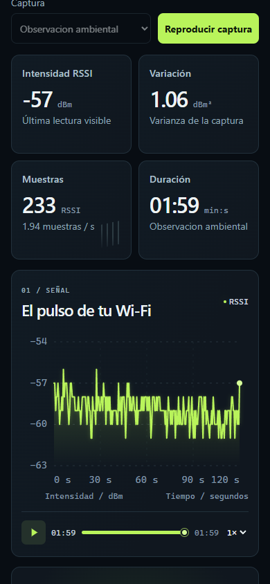
9. **Reproducir en móvil — funcional con control incoherente.** Los datos avanzan; la acción principal no cambia a pausa.  
   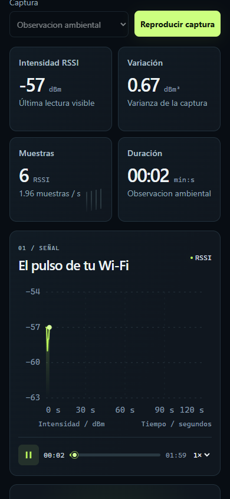
10. **Preparar captura local — funcional, semántica mejorable.** Formulario disponible en el servidor local conocido. No se inició captura.  
    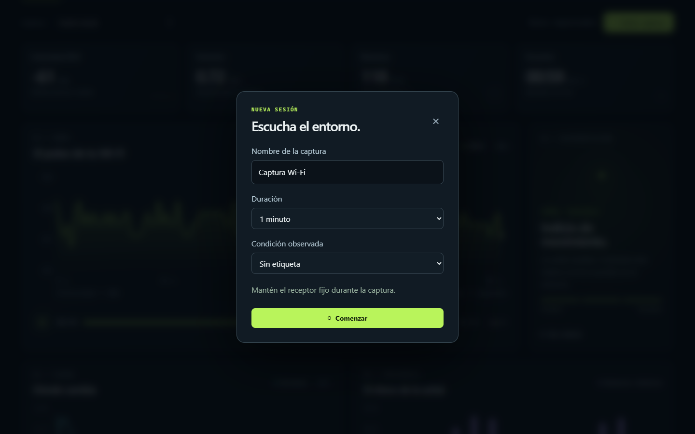
11. **Elegir protocolo caminando — claro.** Se muestra la indicación de mantener la laptop fija; la selección se canceló.  
    
12. **Consultar criterio de calidad — honesto, recuperación insuficiente.** Se ven la ventana y la irregularidad, pero falta una siguiente acción.  
    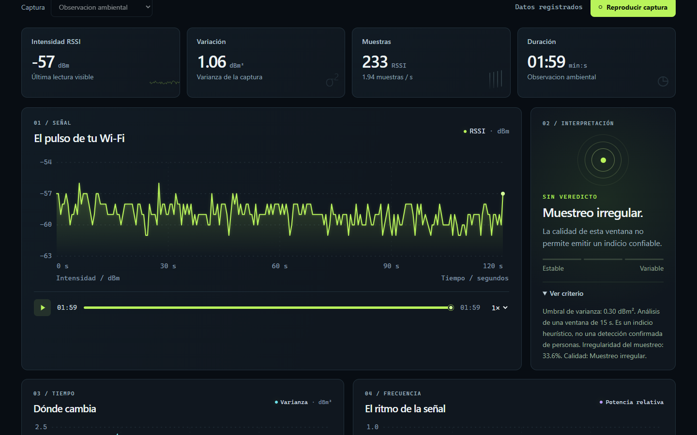

## Orden de corrección

1. Resolver entrada, anclas y orientación; hacer visibles los accesos a entregables y ejecución local.
2. Hacer revisable la evidencia y relacionar cada gráfica con su ventana real.
3. Sincronizar reproducción, mejorar nombres accesibles y añadir recuperación de calidad.
4. Repetir el recorrido con primer viewport y enlaces directos, a 1440 y 390 px, sin confundir un pase funcional con una evaluación perfecta.

El siguiente paso es integrar estos hallazgos con la auditoría científica y del PDF, y después implementar las correcciones acordadas en ese reporte consolidado.
